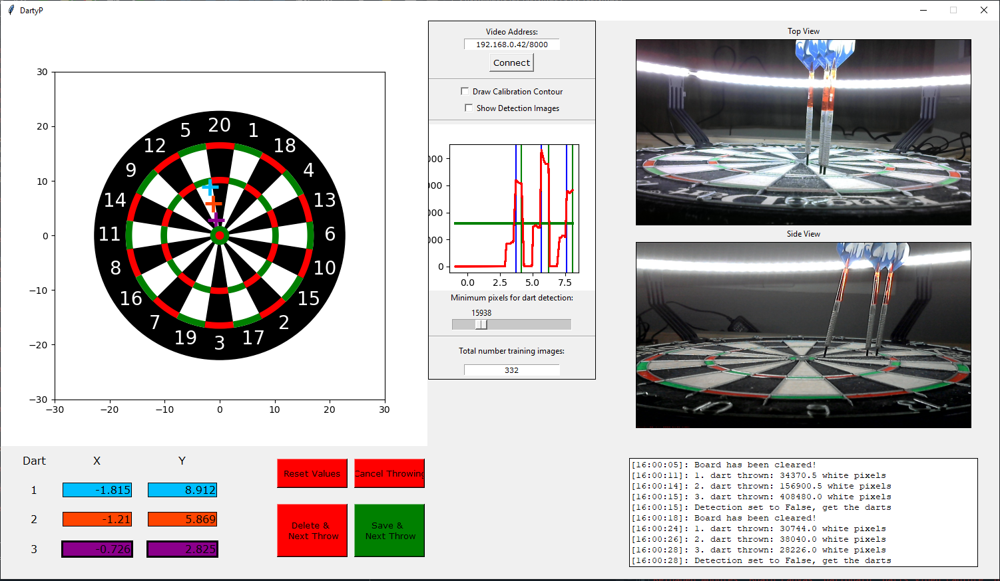

# CNN_DartsTrainer
 This app will be used to collect images of a dart board from two different camera angles. The user can determine where the darts hit and to help to train a neural network with this data afterwards

